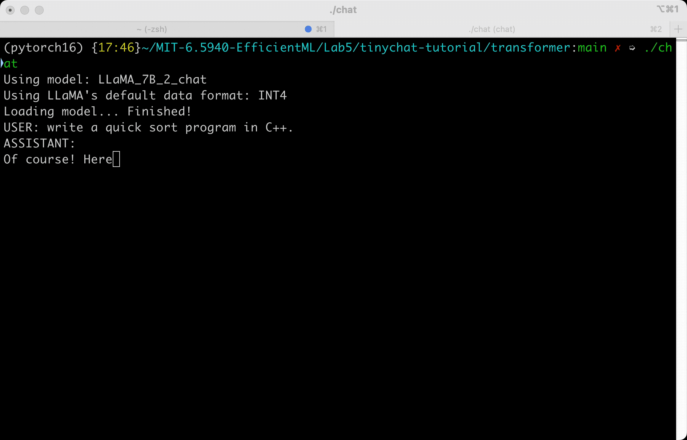
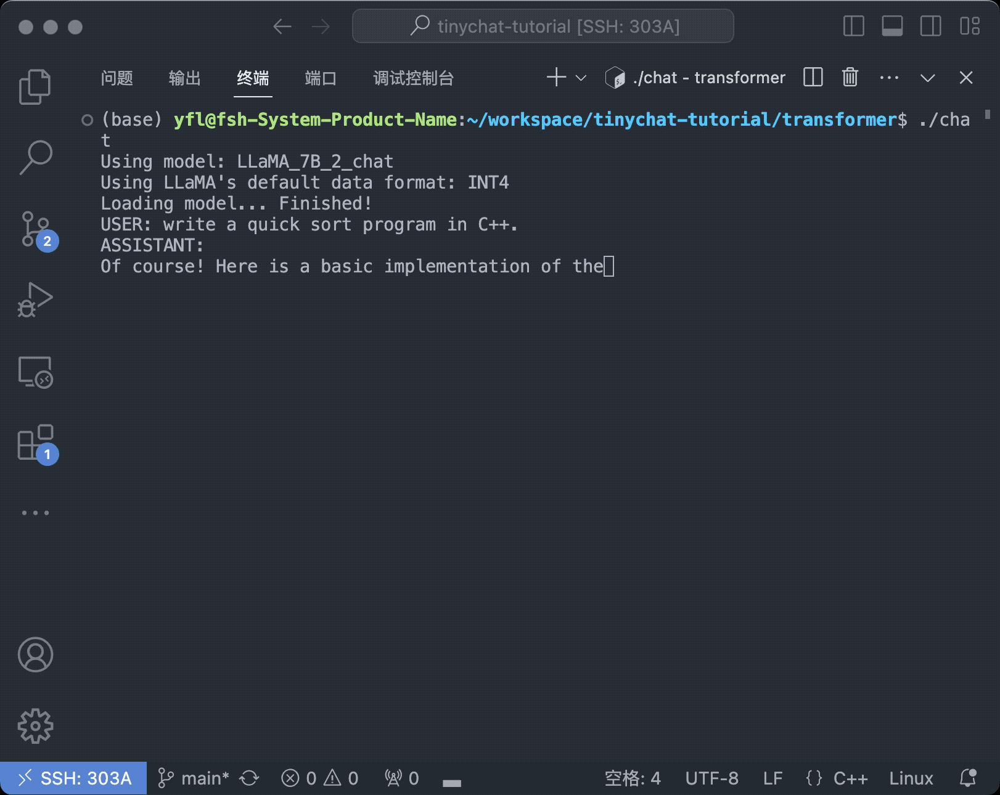

# MIT-6.5940
TinyML and Efficient Deep Learning Computing 6.5940 • Fall • 2023 • https://efficientml.ai

## Introduction

This is my implementation of MIT-6.5940 Labs.

I passed all the tests in the notebook and fixed minor errors in the original notebook. You can use it as a reference.

- [x] Lab1
- [x] Lab2
- [x] Lab3
- [x] Lab4
- [x] Lab5 (x86 arch)

### Note on Lab 5
The naive implemenation can be extremely slow. You may have to wait more than 10 minutes to get llama2's answer.

I provide my benchmarks of each accerleration implementation on two devices.

**MacBook Pro (15-inch, 2018)**

- Arch x86
- CPU: 6 Intel i7 Cores (2.2 GHz)
- Mem: 16 GB 2400 MHz DDR4

```
➭ ./evaluate.sh reference
-------- Sanity check of reference implementation: Passed! -------- 
Section, Total time(ms), Average time(ms), Count, GOPs
reference, 3377.129150, 337.712006, 10, 0.776233

➭ ./evaluate.sh loop_unrolling
-------- Sanity check of loop_unrolling implementation: Passed! -------- 
Section, Total time(ms), Average time(ms), Count, GOPs
loop_unrolling, 3335.317139, 333.531006, 10, 0.785964


➭ ./evaluate.sh multithreading
-------- Sanity check of multithreading implementation: Passed! -------- 
Section, Total time(ms), Average time(ms), Count, GOPs
multithreading, 887.180054, 88.718002, 10, 2.954801


➭ ./evaluate.sh simd_programming
-------- Sanity check of simd_programming implementation: Passed! -------- 
Section, Total time(ms), Average time(ms), Count, GOPs
simd_programming, 2073.361084, 207.336014, 10, 1.264343


➭ ./evaluate.sh multithreading_loop_unrolling
-------- Sanity check of multithreading_loop_unrolling implementation: Passed! -------- 
Section, Total time(ms), Average time(ms), Count, GOPs
multithreading_loop_unrolling, 838.462036, 83.846001, 10, 3.126486


➭ ./evaluate.sh all_techniques               
-------- Sanity check of all_techniques implementation: Passed! -------- 
Section, Total time(ms), Average time(ms), Count, GOPs
all_techniques, 227.922012, 22.792002, 10, 11.501479
```

**Linux Desktop Computer**

- Arch: x86
- CPU: AMD Ryzen 9 5900X 12-Core (3.7GHz)
- Mem: 64 GB 2400 MHz DDR4


```
$ ./evaluate.sh reference
-------- Sanity check of reference implementation: Passed! -------- 
Section, Total time(ms), Average time(ms), Count, GOPs
reference, 2726.144043, 272.614014, 10, 0.961593


$ ./evaluate.sh loop_unrolling
-------- Sanity check of loop_unrolling implementation: Passed! -------- 
Section, Total time(ms), Average time(ms), Count, GOPs
loop_unrolling, 2177.221924, 217.722000, 10, 1.204030


$ ./evaluate.sh multithreading
-------- Sanity check of multithreading implementation: Passed! -------- 
Section, Total time(ms), Average time(ms), Count, GOPs
multithreading, 720.249023, 72.024002, 10, 3.639630


$ ./evaluate.sh simd_programming
-------- Sanity check of simd_programming implementation: Passed! -------- 
Section, Total time(ms), Average time(ms), Count, GOPs
simd_programming, 1852.494995, 185.248993, 10, 1.415086


$ ./evaluate.sh multithreading_loop_unrolling
-------- Sanity check of multithreading_loop_unrolling implementation: Passed! -------- 
Section, Total time(ms), Average time(ms), Count, GOPs
multithreading_loop_unrolling, 570.304993, 57.029999, 10, 4.596558


$ ./evaluate.sh all_techniques
-------- Sanity check of all_techniques implementation: Passed! -------- 
Section, Total time(ms), Average time(ms), Count, GOPs
all_techniques, 177.613007, 17.761000, 10, 14.759280

```

### Results
**MacBook Pro (15-inch, 2018)** 8 threads, but it is still slow.



**Linux Desktop Computer** 

64 threads, it is obviously faster. But I can't get the speed shown in the tutorial. Any discussion is welcomed.



## Acknowledge
Many thanks to Professor Song Han for sharing suching an excellent course!
